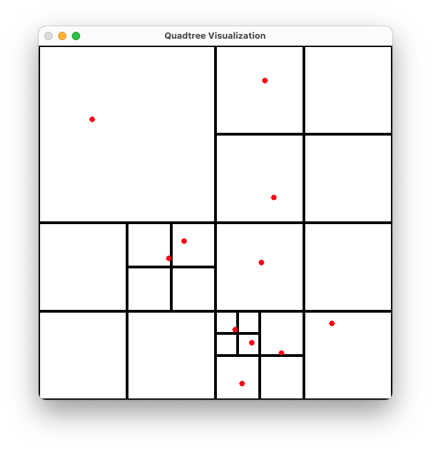

# Quadtree
Implementación con visualización del Quadtree.


### Grupo 4
 - Sebastian Knell
 - Massimo Imparato
 - Diego Enciso
 - Jean Angeles

### Dependencias
* cmake
* opencv

### Como correr?
```shell
mkdir build
cd build
cmake ..
make
./Quadtree
```

### Como usar?
* Insertar punto con click izquierdo
* Eliminar punto con click derecho (falta)
* Salir con la tecla 'q'